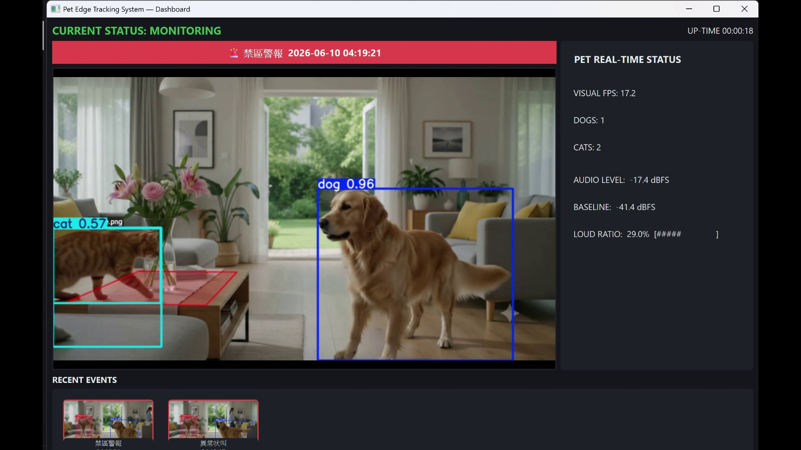

# Pet Edge Tracking System (PET)

Local, no-cloud edge-AI for pet monitoring. Combines an **audio core** (abnormal /
continuous barking detection) and a **vision core** (YOLO-World dog/cat detection)
behind a single **PySide6 dashboard** — everything runs on the local PC.

## Demo

[](demo_video/demo_all.mp4)

▶ **點上方縮圖觀看完整 demo 影片** ([demo_video/demo_all.mp4](demo_video/demo_all.mp4))
— 即時偵測(狗/貓)、禁區越界警報、異常吠叫、RECENT EVENTS 事件記錄與 n8n 路由。
（其餘測試影片不納入版本控制；詳見 [PROTOTYPE.md](PROTOTYPE.md)。）

## Components

| File | Role |
|---|---|
| [bark_detector.py](bark_detector.py) | **Audio core** — abnormal barking detection from the microphone (Scenario 1). Runs standalone. |
| [yolo_world_detector.py](yolo_world_detector.py) | **Vision core** — YOLO-World open-vocabulary dog/cat detection on images/video. Converted from the original Colab notebook. |
| [pet_dashboard.py](pet_dashboard.py) | **Unified dashboard** — one window combining live video + detection boxes, real-time status panel, recent-events strip, and a barking-alert banner. |
| [make_test_clip.py](make_test_clip.py) | Helper that generates a reproducible A/V test clip (quiet → loud burst) for verifying the dashboard. |

## Setup

```bash
pip install -r requirements.txt
```

Tested in a conda env (`pet_monitor`, Python 3.11) on Windows. Torch installs as a
CPU build by default; install a CUDA build for real-time vision speed (see *Performance*).

## 1. Vision core — build the model & detect

```bash
# Build the customized dog/cat model (downloads yolov8l-world.pt ~91 MB on first run)
python yolo_world_detector.py --customize --save-model dogandcat.pt

# Detect on an image or a folder; annotated copies go to out/
python yolo_world_detector.py --model dogandcat.pt --predict some_image.jpg --save-dir out

# Detection-confidence statistics over a folder
python yolo_world_detector.py --model dogandcat.pt --analyze path/to/images --class dog
```

## 2. Audio core — barking detector (standalone)

```bash
python bark_detector.py --list-devices       # find your mic index
python bark_detector.py -v                    # default mic, live level meter
python bark_detector.py --device 3 -v         # specific device
```

Press `Ctrl+C` to stop.

### How bark detection works

1. Capture mic audio at 16 kHz, 100 ms frames.
2. Compute a **rolling baseline** of background noise (median dBFS over the last 30 s).
3. Flag each frame as *loud* if it exceeds `baseline + LOUD_MARGIN_DB`.
4. Slide a **10 s window** over the flags. When ≥ `LOUD_RATIO` of frames are loud, fire an alert (terminal banner + OS notification).
5. 30 s cooldown so one barking episode only alerts once.

It detects **sustained loudness relative to the room baseline**, not the timbre of a
bark — so the ratio rule handles real bark cadence (汪—汪—汪 with gaps) while ignoring
one-off bangs.

### Tuning knobs (in [bark_detector.py](bark_detector.py), also CLI flags)

| Constant / flag | Default | Meaning |
|---|---|---|
| `LOUD_MARGIN_DB` / `--loud-margin` | 8 dB | How far above baseline counts as "loud" |
| `LOUD_RATIO` / `--loud-ratio` | 0.30 | Fraction of frames in the window that must be loud |
| `DETECT_WINDOW_S` | 10 s | Sustained-bark window length |
| `BASELINE_WINDOW_S` | 30 s | Rolling baseline length |
| `COOLDOWN_S` | 30 s | Minimum gap between alerts |

## 3. Unified dashboard

```bash
# Live mic for audio + video file for vision
python pet_dashboard.py --source sample_av.mp4 --model dogandcat.pt

# Use the VIDEO's own audio track for bark detection (PyAV) instead of the mic
python pet_dashboard.py --source sample_av.mp4 --model dogandcat.pt --audio-source video

# Smoother display: run detection every Nth frame (reuse boxes between)
python pet_dashboard.py --source sample_av.mp4 --model dogandcat.pt --stride 3
```

Options: `--audio-source {mic,video}`, `--device <mic idx>`, `--conf`, `--stride N`, `--no-loop`.

The audio and vision cores run in **separate threads** and communicate with the GUI via
Qt signals, so a slow video FPS never delays bark detection.

### Generating a test clip

`sample_av.mp4` (and `sample.mp4`) are git-ignored. Recreate a reproducible clip with:

```bash
python make_test_clip.py        # needs images under test/Dog and test/Cat
```

## 4. n8n integration (Action Output stage)

Visualize **which stage of the system the demo reaches** by routing events through an
[n8n](https://n8n.io) workflow. When an event fires, the detectors POST a small JSON
payload to an n8n **Webhook** node; n8n then represents the "Action Output" stage
(route by scenario → notify / log).

The workflow routes these event types by scenario: `abnormal_barking` (Scenario 1),
`danger_zone` (Scenario 2), and `pet_in` / `pet_out` (Scenario 0).

```bash
# Dashboard posts barking, danger-zone, and pet in/out events
python pet_dashboard.py --source test_more.mp4 --model dogandcat.pt \
    --audio-source video --danger-zone auto \
    --n8n-webhook http://localhost:5678/webhook/pet-event

# Standalone barking detector can post too
python bark_detector.py -v --n8n-webhook http://localhost:5678/webhook/pet-event
```

Setup:
1. In n8n, **Import from File** → [n8n_pet_workflow.json](n8n_pet_workflow.json).
2. Open the **Webhook (Data Input)** node, copy its Test/Production URL, pass it to `--n8n-webhook`.
3. Activate the workflow (or click *Listen for test event*). Trigger a bark — the
   `Webhook → Switch → Action` path lights up live, showing the demo's stage.

Event payload = the **ICD-COMP-UI-001 `ALERT_TRIGGER`** interface (B.COMP → B.UI),
carrying the three ICD fields `Event_Type, Confidence_%, Timestamp` (see [n8n_client.py](n8n_client.py)):

```json
{ "interface": "ICD-COMP-UI-001", "signal": "ALERT_TRIGGER", "source_block": "B.COMP",
  "Event_Type": "danger_zone", "Confidence_%": 47, "Timestamp": "...", "scenario": 2, "message": "..." }
```

`Confidence_%` = YOLO box confidence ×100 for vision events, loud-ratio ×100 for barking.
The n8n **Event Dispatcher** routes on `Event_Type` (it dispatches, it does not classify —
the abnormal-behaviour decision is the Logic Core in B.COMP / Python).

A webhook failure never interrupts detection (errors are logged and swallowed).

## Performance

`dogandcat.pt` is built on **yolov8l-world** (large). On CPU, per-frame detection is
~0.7 s at `imgsz=480`, so dashboard display drops from the source 25 FPS to ~1–2 FPS.

- `--stride N` raises display smoothness (detection every Nth frame): stride 3 ≈ 3 FPS.
- Smaller base model (`--base-model yolov8s-world.pt` when customizing) is 2–4× faster on CPU.
- A **CUDA** torch build typically reaches 25+ FPS — the most effective fix.

## Known limitations

- **Audio has no species classification.** Loud TV/vacuum/shouting can also trigger. v2: add a small audio classifier (e.g. YAMNet) before the threshold step.
- **Single-channel audio.** Array-mic features (direction, denoising) not used.
- **CPU vision is slow** (see *Performance*).
- **Scope:** current dashboard implements the MVP (dual core + live view + alerts). Scenario 0 daily logging, Scenario 2 danger-zone fence, and Scenario 3 low-resource degradation are not yet implemented.

## Repository notes

Large/regenerable files are git-ignored (see [.gitignore](.gitignore)): model weights
(`*.pt`, `weights/`), media (`*.mp4`, `out/`), downloaded `test/` images, and the
309 MB source notebook. After cloning, `pip install -r requirements.txt` and run the
`--customize` step above to regenerate `dogandcat.pt`.
